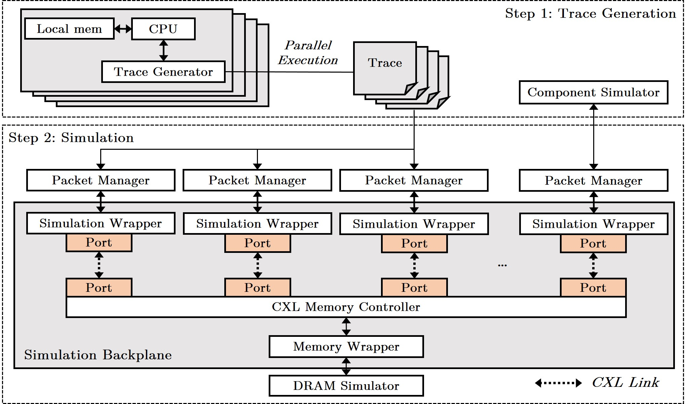

**Trace-driven simulation framework** that offers a solution for evaluating the performance of **CXL-based memory systems** in HPC environments.

We provide both **timing** and **functional simulations** based on user parameters.

## Simulator Structure


## Index 
- [Prerequisite](#Prerequisite)
- [Simulation Configuration](#Simulation-Configuration)
- [Trace Files](#Trace-Files)
- [How to Compile](#How-to-Compile)
- [How to Run](#How-to-Run)
  
## Prerequisite
- [Ramulator2](https://github.com/CMU-SAFARI/ramulator2)
- All dependencies required by **SystemC 3.0.0**

## Simulation Configuration
- All parameters are reconfigurable by users.
- **system.json**
```
host_num : 2,  
packet_size : 1024, // Byte

// CXL parameters
flit_size : 64, // Byte
link_efficiency : 0.928, 
PCIe_raw_bandwidth : 37, // Byte per nanosecond
cxl_port_latency : 62, // nanosecond
cxl_ic_latency : 15, // nanosecond

// CPU configurations
cpu0 :
{ 
  freq : 2.1, //Ghz
  cpu_latency : 45, // nanosecond (Core+LLC)
},  
cpu1 :
{ 
  freq : 2.1, //Ghz
  cpu_latency : 45, // nanosecond (Core+LLC)
}

```
  
- **memory.json**
```
dram_num : 1,
dram0 :
{
  config : DDR5_3200C, //Ramulator2
  size : 0xc0000000,
  freq : 1.6,
}
```

## Trace Files
- **Trace (Type : Address : Size : Data)**
  - Data is only needed for **Write** operations  
```
W:0:1024: 
R:1024:1024:
Terminate:0:0:
```
- **Delta (nanoseconds)**
```
1000
1000
1000
```

## How to Compile
- **cxlsim**
```
git clone 
mkdir build && build
cmake ..
make
```
- **Ramulator2**
```
git clone https://github.com/CMU-SAFARI/ramulator2.git
cd ramulator2
mkdir build && cd build
cmake ..
make
```
  - Some modifications for integration.
    - **ramulator2/CMakeList.txt** *(need to fix)*
    - **ramulator2/src/CMakeList.txt** *(need to fix)*
    - **ramulator2/src/base/request.h** *(need to fix)*
    - **ramulator2/src/base/request.cpp** *(need to fix)*
    - **ramulator2/src/dram_controller/impl/generic_dram_controller.cpp** *(need to fix)*
    - **ramulator2/config/example_config.yaml** *(need to add)*
    - **ramulator2/src/Bridge.cpp** *(need to add)*
    - **ramulator2/src/Bridge.h** *(need to add)*

## How to Run
```
./cxlsim
```
